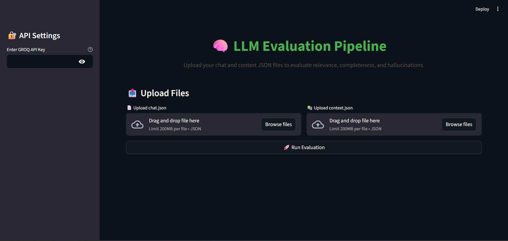
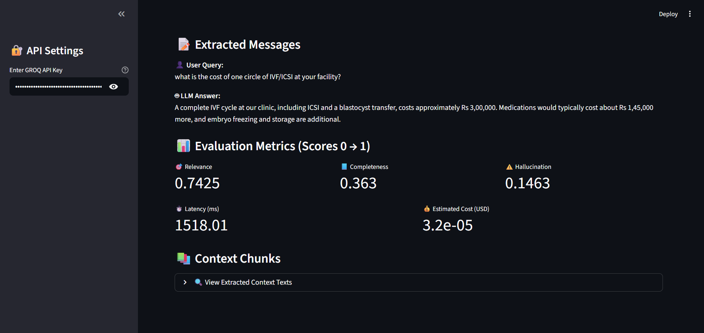

# LLM Evaluation Pipeline

This repository contains an evaluation system for Large Language Model (LLM) responses.
Given two files:

chat.json — a raw conversation between user and assistant (may be unstructured or invalid JSON)

context.json — retrieved context chunks from a vector database

The pipeline extracts the relevant messages, computes embeddings, and produces evaluation scores for:

->Relevance

->Completeness

->Hallucination

->Latency

A Streamlit-based UI is also included for testing and demonstration.

----------------------------------------------------------------------
# Live Demo: https://llmevaluationpipeline-8cnhgqzntpsowgumfrbgwe.streamlit.app/
----------------------------------------------------------------------

### 1. Project Structure

### 2. Local Setup Instructions
#### Step 1: Clone Repository

git clone <https://github.com/CoderJaynt/LLM_Evaluation_Pipeline.git>
cd llm-eval

#### Step 2: Create Virtual Environment
python -m venv venv
venv\Scripts\activate

#### Step 3: Install Dependencies
pip install -r requirements.txt

### 3. Running the CLI Evaluation Pipeline
python pipeline.py --chat sample_data/chat-1.json --context sample_data/context-1.json

### 4. Running the Streamlit App
streamlit run app.py

-> The app will launch at:
http://localhost:8501

### 5. Architecture Overview

               +------------------+
               |   chat.json      |
               +--------+---------+
                        |
                        v
          +-----------------------------+
          |    json_cleaner.py         |
          | (Extract user + assistant) |
          +-----------------------------+
                        |
                        v
               +------------------+
               |  pipeline.py     |
               +--------+---------+
                        |
              +---------+----------+
              | Extract Context    |
              | Embed Texts        |
              | Compute Scores     |
              +---------+----------+
                        |
                        v
              +---------------------+
              | Evaluation Output   |
              +---------------------+

### 6. Streamlit UI Screenshots
Streamlit Homepage:

Streamlit Evaluation Output:

